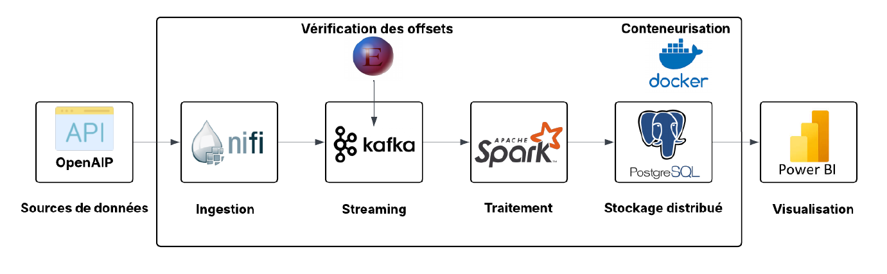
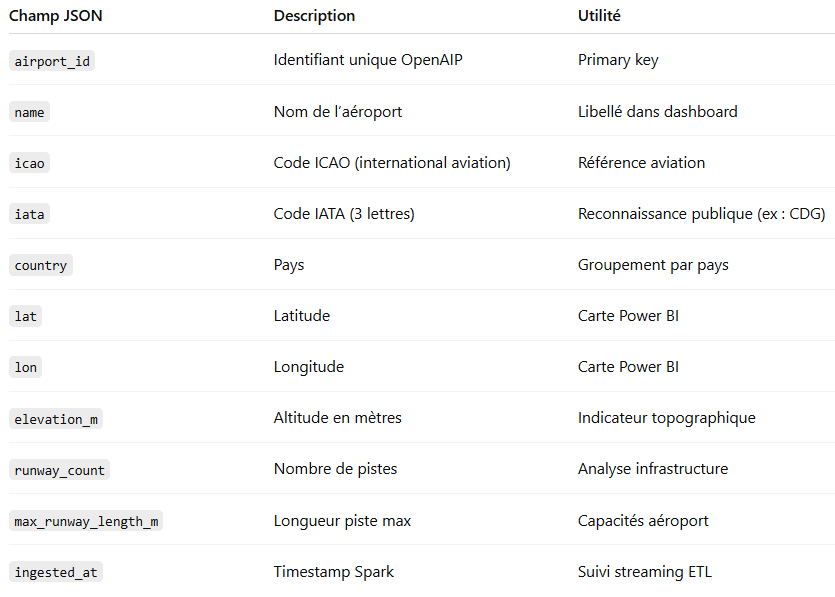
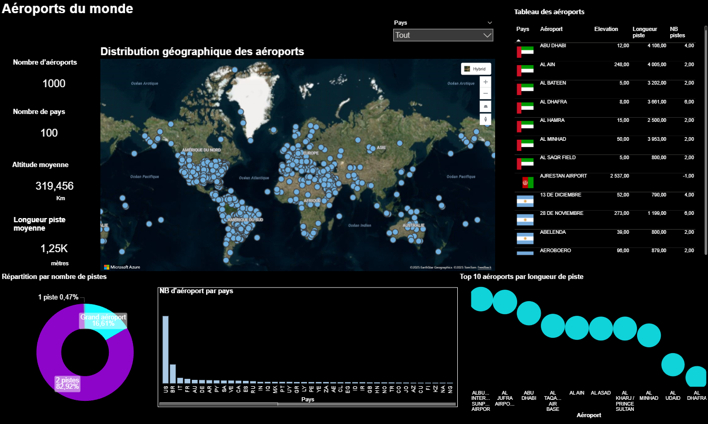
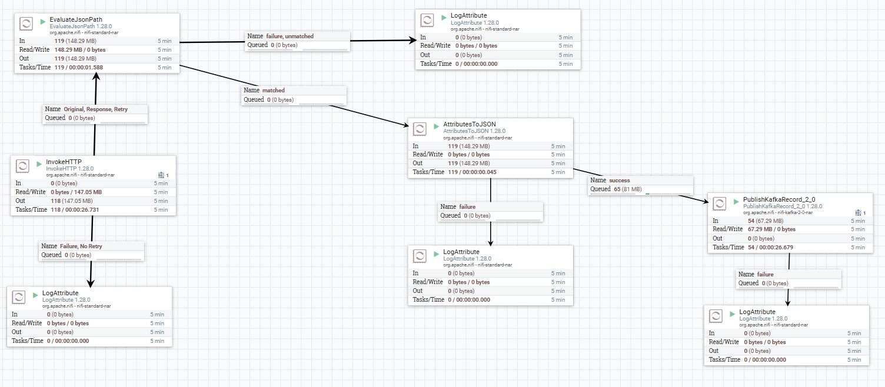
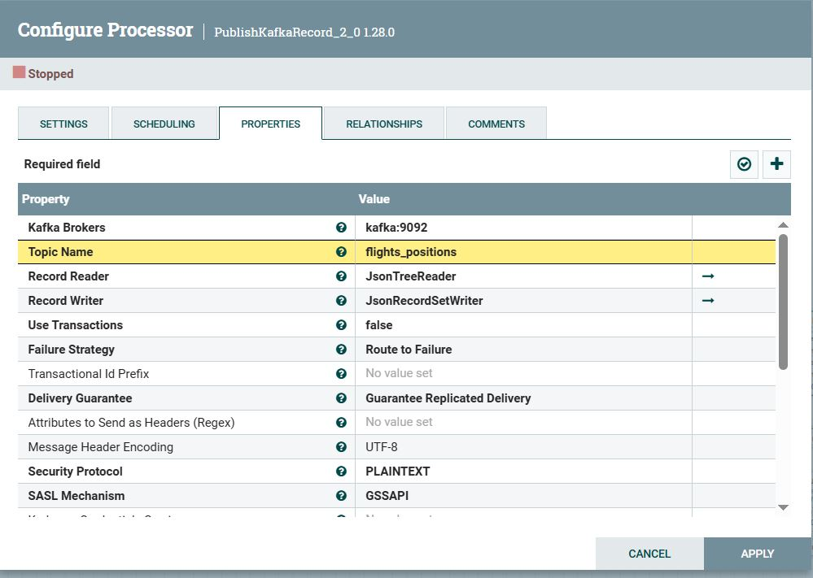
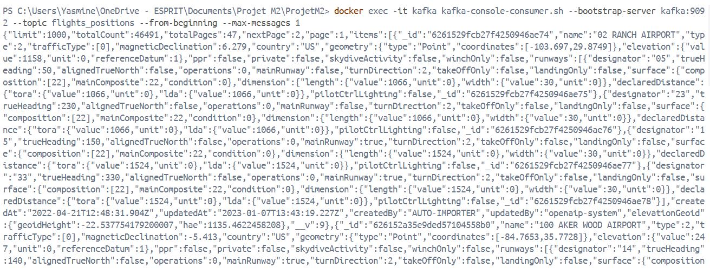

#  Projet M2 — Pipeline ETL Distribué (Données Aériennes)

**Durée** : 1 semaine  
**Binôme** : Eya Bensalem & Yasmine  

##  Objectif

Mettre en place un **pipeline Big Data distribué** pour collecter, traiter et visualiser des **données aériennes en temps réel** à partir de l’API *OpenAIP*.

Le pipeline repose sur les technologies suivantes :  
**Apache NiFi → Apache Kafka → Apache Spark → PostgreSQL → Power BI**


##  Architecture globale



> Ce pipeline réalise un traitement complet des données aériennes :  
> - **NiFi** ingère les données JSON depuis l’API OpenAIP.  
> - **Kafka** assure la transmission des messages.  
> - **Spark Streaming** lit les flux Kafka, nettoie et normalise les données.  
> - **PostgreSQL** stocke les résultats structurés.  
> - **Power BI** permet la visualisation et l’analyse des indicateurs en temps réel.


##  Explication des composants

###  **NiFi**
- Interroge l’API:**OpenAIP** toutes les **30 secondes**.  
- Nettoie et reformate les données.  
- Publie les messages JSON vers le Topic **Kafka** (`flights_positions`).  

Flux NiFi :

InvokeHTTP → EvaluateJsonPath → AttributesToJSON → PublishKafkaRecord_2_0


###  **Kafka**
- Topic principal : `flights_positions`
- Sert de **file d’attente distribuée** entre NiFi et Spark.
- Vérification des messages via **Offset Explorer** (visualisation des partitions et offsets).


### **Apache Spark**

Fichier principal : `stream_flights.py`  

Lecture depuis Kafka, parsing JSON, aplatissement, et écriture dans **PostgreSQL**.

#### Données traité
- Données sur les **aéroports** (id, nom, pays, coordonnées, longueur des pistes, altitude, etc.)
 



### **PostgreSQL**

La table crée :

| Table              | Description                                                         |
| ------------------ | ------------------------------------------------------------------- |
| **airports_clean** | Données nettoyées sur les aéroports (structure issue du code Spark) |


### **Power BI**
Le tableau de bord Power BI permet d’explorer et analyser les aéroports du monde grâce aux données traitées par le pipeline Big Data.

La base **PostgreSQL** est connectée à Power BI pour la visualisation.

#### Visualisations :

🌍 Carte mondiale

Affiche tous les aéroports par localisation (lat/lon) pour visualiser leur distribution globale.




🔢 Indicateurs clés

Nombre d’aéroports

Nombre de pays

Altitude moyenne

Longueur moyenne des pistes

🍩 Répartition par nombre de pistes

Donut chart montrant la proportion d’aéroports selon leur nombre de pistes.

📊 Nombre d’aéroports par pays

Classement des pays selon leur quantité d’aéroports.

🛫 Top 10 plus longues pistes

Graphique en bulles affichant les aéroports avec les plus grandes pistes (capacité longs courriers/cargos).

📋 Tableau détaillé

Liste interactive des aéroports (pays, nom, altitude, longueur piste, nb pistes).

🎛️ Filtre par pays

Permet de filtrer toutes les visualisations par pays.

##  Lancement global du pipeline

### 1️⃣ Démarrage des conteneurs

```bash
docker compose -f docker-compose-M2DATA.yml up -d
```

### 2️⃣ NiFi → Kafka

Configurer le flux NiFi (`InvokeHTTP → EvaluateJsonPath → AttributesToJSON → PublishKafkaRecord_2_0`).

#### Processeurs Nifi :


#### Configuration du processeur Kafka : 


### 3️⃣ Vérification Kafka

```bash
docker exec -it kafka kafka-topics.sh --bootstrap-server kafka:9092 --list
```

```bash
docker exec -it kafka kafka-console-consumer.sh --bootstrap-serv
er kafka:9092 --topic flights_positions --from-beginning --max-messages 1
```
#### Message envoyé par NiFi à Kafka  :



### 4️⃣ Spark Streaming

```bash
docker exec -it spark-master /opt/spark/bin/spark-submit --master spark://spark-master:7077 --packages org.apache.spark:spark-sql-kafka-0-10_2.12:3.5.1,org.postgresql:postgresql:42.6.0 /tmp/stream_flights.py
```

### 5️⃣ Power BI

Connecter PostgreSQL et actualiser les visuels en temps réel.


## 📂 Structure du projet

| Fichier / Dossier | Description |
|-------------------|-------------|
| `docker-compose-M2DATA.yml` | Configuration Docker de l’environnement Big Data |
| `Scripts/stream_flights.py` | Script Spark Streaming pour ingestion & traitement |
| `Power BI/bi_dashboard.pbix` | Dashboard Power BI d'analyse |
| `Nifi/validation_template.xml` | Flow NiFi exporté pour automatisation |
| `Présentation/Données Distribuées.pptx` | Support de présentation |
| `Présentation/Rapport_Donnees_Distribuees.docx` | Rapport |

